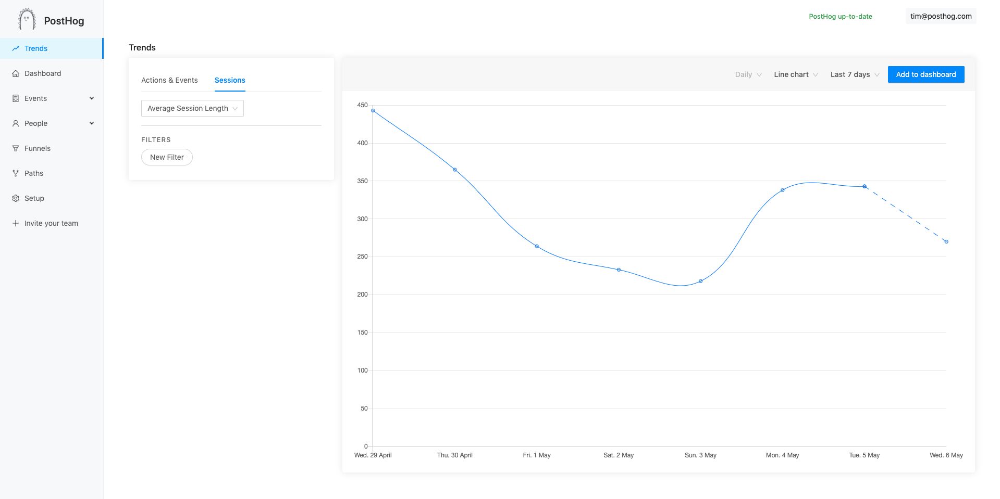
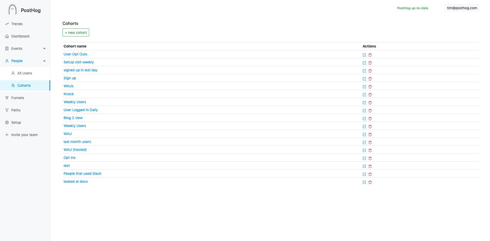
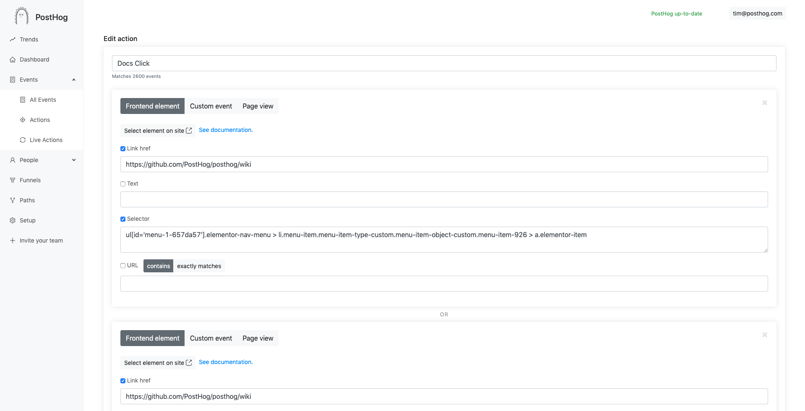

Session times are here! They're a great way to help understand how engaged users are. The Array 1.4.0 brings plenty of improvements to our core functionality.

## Release notes

### [Filter properties individually](https://github.com/PostHog/posthog/pull/671)

In both trends and funnels, you can now add filters for each event individually, rather than for all events.

### [Breakdown by properties in graph](https://github.com/PostHog/posthog/pull/671)

Previously the only way to see properties broken down by value was in a table. Now you can break down on any property and display it in a graph.

Select a property on the left hand side, like $browser, and a line will appear for each value of that property (Chrome, Firefox etc).

### [Session time series](https://github.com/PostHog/posthog/pull/659)

Eric has been hard at work improving the way we display session information. You can now see how the average time spent on your app changes over time.

### [Export cohorts as CSV](https://github.com/PostHog/posthog/pull/441)

This was contributed by [Anoop](https://github.com/anoopemacs), and while it admittedly took a while to get merged it’s a great addition. You can now export a full list of users from any cohort to CSV, including all distinct ids and properties.

### [Edit frontend selectors in Actions](https://github.com/PostHog/posthog/pull/670)

Previously, the only way to edit selectors for frontend elements in actions was to go to your own site and use the toolbar. Now you can do this inside PostHog itself.

### [Setup page redesign](https://github.com/PostHog/posthog/pull/701)

Thanks to Sanket for this one! The setup page now uses Antd too and it looks great.

### [Restrict access to instance by IP](/docs/deployment#restrict-access-by-ip)

You can now restrict access to your instance by IP for extra security. [See docs](/docs/deployment#restrict-access-by-ip) on how to set that up.

## Bug fixes and performance improvements

* More [accurate timestamps](https://github.com/posthog/posthog/pull/693) when users have their computer time set incorrectly.
* [Selecting today + hourly interval didn’t work](https://github.com/posthog/posthog/pull/700).
* [Speed up cohorts page](https://github.com/posthog/posthog/pull/706) loading and use Antd.
* [Add screen name](https://github.com/posthog/posthog/pull/681) to events table for mobile apps.
 
## Favorite issue

### [“Compare to” in charts #715](https://github.com/PostHog/posthog/issues/715)

Thanks to [Paolo](https://github.com/PaoloC68) for raising this issue. It’d be great to have the ability to compare certain timeframes against each other.

Feel free to comment on the issue if you have any other ideas about this!

## Weekly round up

* [How Sustainable is a Solar Powered Website?](https://www.lowtechmagazine.com/2020/01/how-sustainable-is-a-solar-powered-website.html)
* [Moufette](https://github.com/moufette-tools/moufette), a tool inspired by PostHog(!) that allows your users to give instant feedback on any page in your app

## PostHog news

We’re growing rapidly, and we’re constantly expanding our team. We’re looking for a [strong devops engineer](https://news.ycombinator.com/item?id=23044768) to join us. If that sounds like you, please email tim@posthog.com.